# システム構成図・インターフェース図

## 目次
1. [システム全体構成図](#1-システム全体構成図)
2. [インフラ構成図（Azure）](#2-インフラ構成図azure)
3. [アプリケーションアーキテクチャ図](#3-アプリケーションアーキテクチャ図)
4. [データフロー図](#4-データフロー図)
5. [APIインターフェース図](#5-apiインターフェース図)
6. [認証フロー図](#6-認証フロー図)
7. [AIマッチング処理フロー図](#7-aiマッチング処理フロー図)
8. [会話チャット処理フロー図](#8-会話チャット処理フロー図)
9. [ER図（データベース）](#9-er図データベース)
10. [デプロイメントフロー図](#10-デプロイメントフロー図)

---

## 1. システム全体構成図

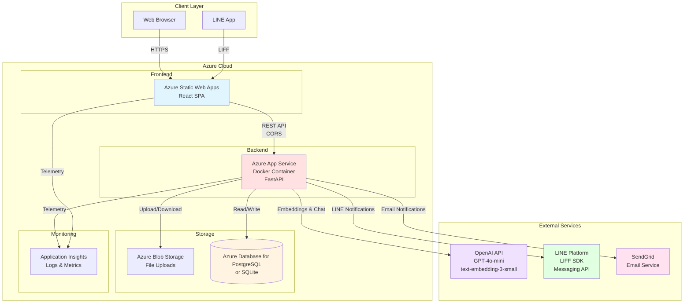

---

## 2. インフラ構成図（Azure）

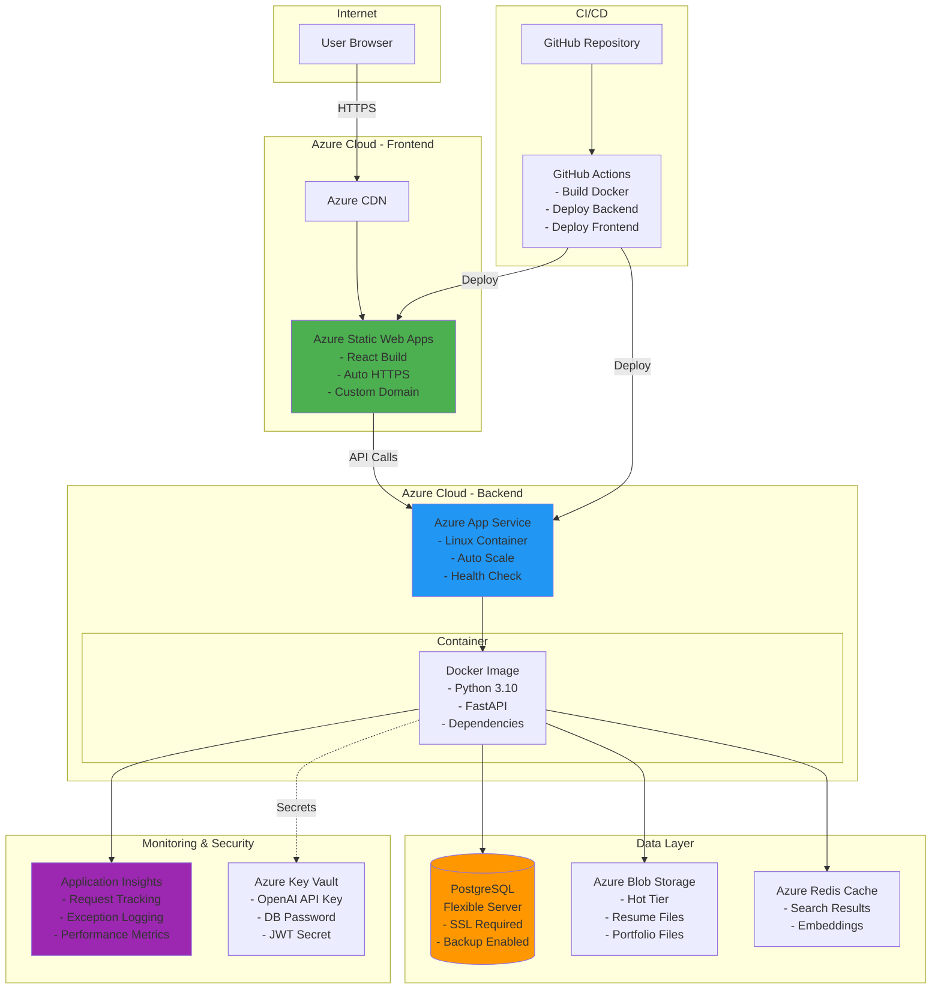

---

## 3. アプリケーションアーキテクチャ図

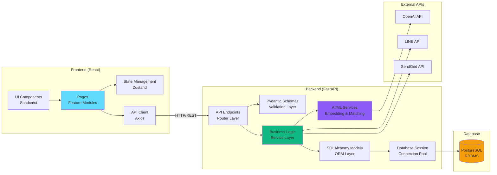

---

## 4. データフロー図

### 4.1 求職者の求人検索フロー

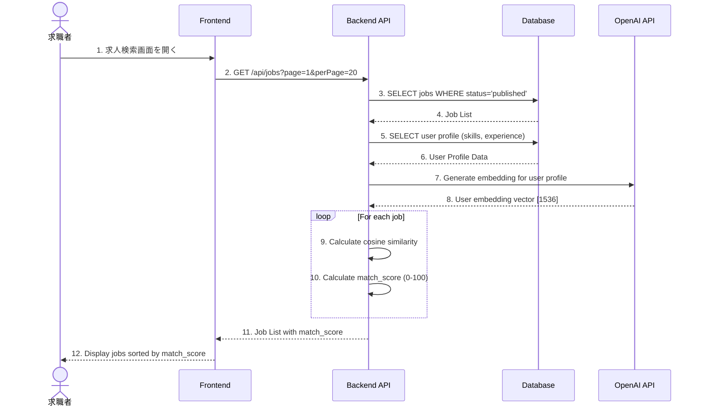

### 4.2 企業の候補者検索フロー

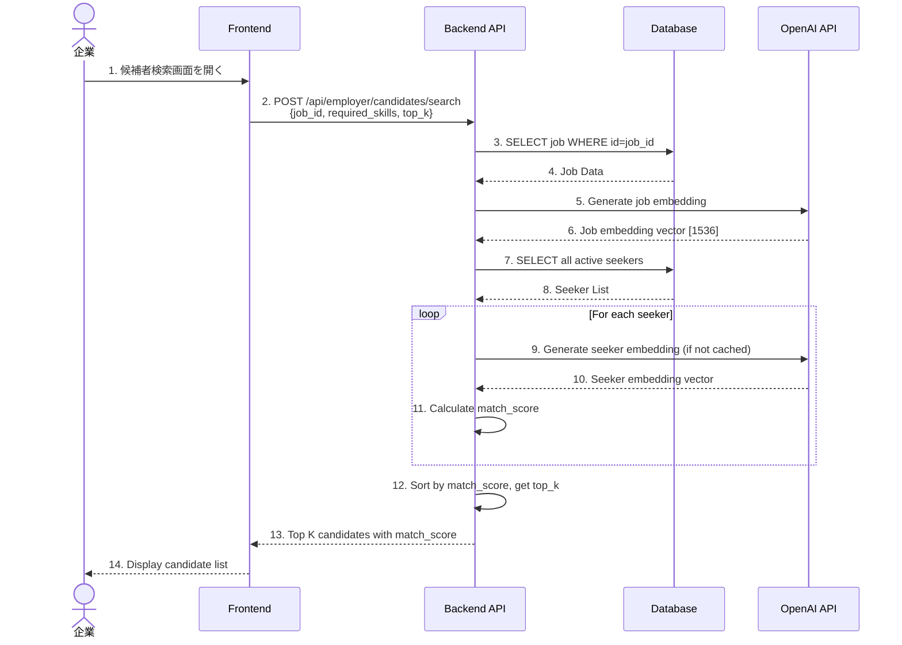

---

## 5. APIインターフェース図

```mermaid
graph TB
    subgraph "Frontend Application"
        AUTH_PAGE[Login/Register Page]
        HOME_PAGE[Home Page]
        JOBS_PAGE[Jobs Page]
        CHAT_PAGE[Chat Page]
        APP_PAGE[Applications Page]
        SCOUT_PAGE[Scouts Page]
        CAND_PAGE[Candidates Page]
    end

    subgraph "Backend API Endpoints"
        AUTH_API[/api/auth/*<br/>POST /login<br/>POST /register<br/>POST /refresh]

        USER_API[/api/users/*<br/>GET /me<br/>PUT /profile<br/>POST /preferences]

        JOBS_API[/api/jobs/*<br/>GET /<br/>GET /:id<br/>POST /search<br/>POST / create]

        MATCH_API[/api/matching/*<br/>POST /recommendations<br/>POST /career-chat<br/>POST /calculate-score]

        APP_API[/api/applications/*<br/>GET /<br/>POST /<br/>PUT /:id/status]

        SCOUT_API[/api/scouts/*<br/>GET /<br/>POST /<br/>PUT /:id/status]

        EMP_API[/api/employer/*<br/>POST /candidates/search<br/>GET /candidates/:id]
    end

    AUTH_PAGE -->|POST| AUTH_API
    HOME_PAGE -->|GET| USER_API
    HOME_PAGE -->|GET| JOBS_API
    HOME_PAGE -->|GET| APP_API

    JOBS_PAGE -->|GET, POST| JOBS_API
    JOBS_PAGE -->|POST| MATCH_API

    CHAT_PAGE -->|POST| MATCH_API

    APP_PAGE -->|GET, POST| APP_API

    SCOUT_PAGE -->|GET, POST, PUT| SCOUT_API

    CAND_PAGE -->|POST| EMP_API

    style AUTH_API fill:#ef4444
    style USER_API fill:#3b82f6
    style JOBS_API fill:#10b981
    style MATCH_API fill:#8b5cf6
    style APP_API fill:#f59e0b
    style SCOUT_API fill:#ec4899
    style EMP_API fill:#06b6d4
```

---

## 6. 認証フロー図

### 6.1 新規登録・ログインフロー

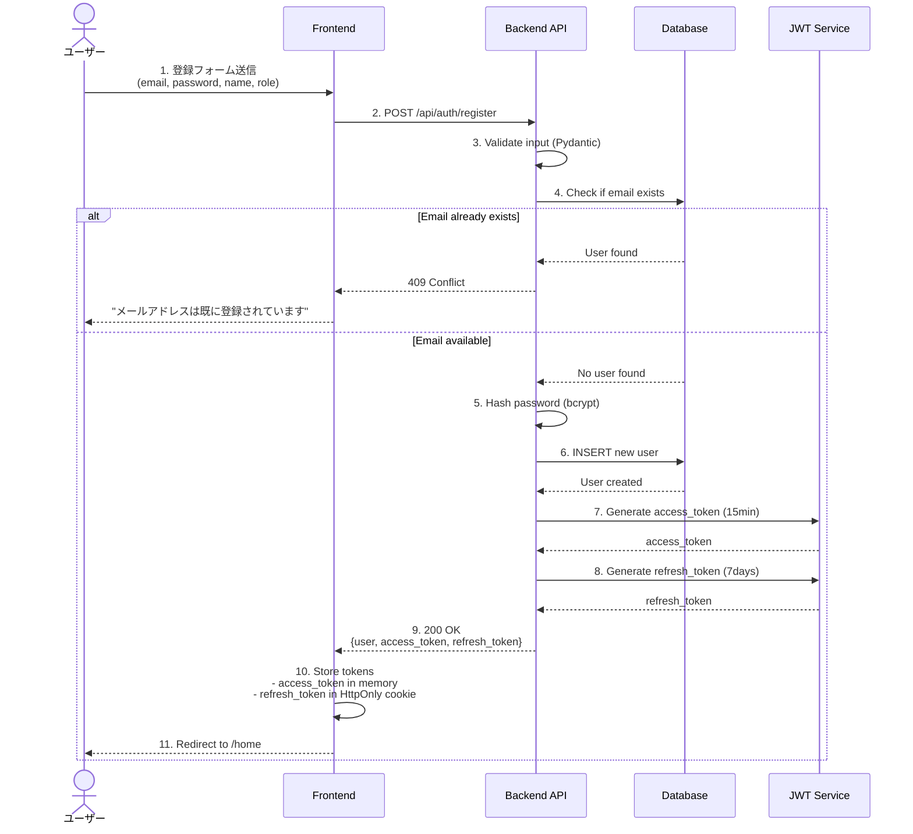

### 6.2 トークン更新フロー（Silent Refresh）

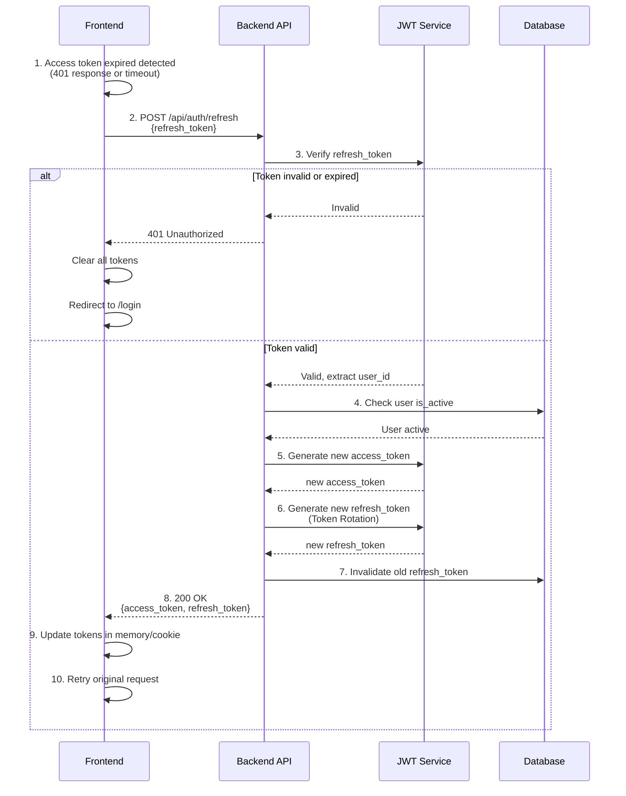

### 6.3 LINE連携フロー

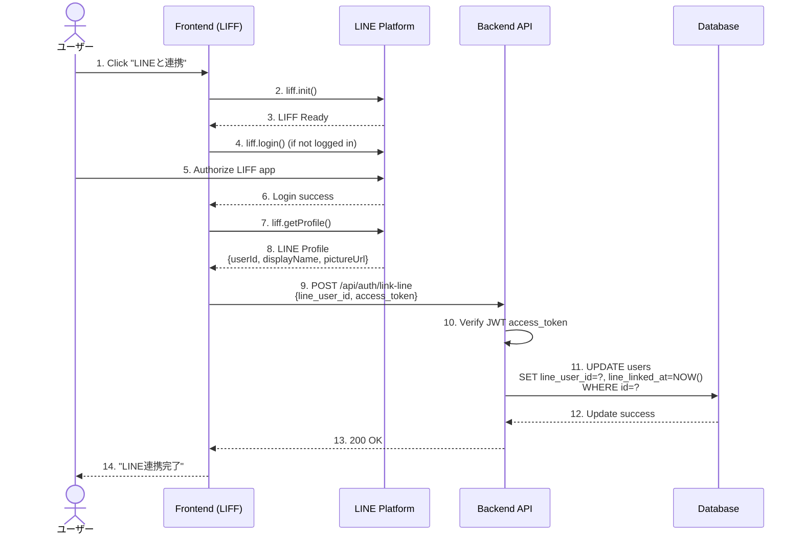

---

## 7. AIマッチング処理フロー図

```mermaid
flowchart TD
    START([Start: User opens Jobs Page]) --> FETCH_PROFILE[Fetch User Profile from DB<br/>skills, experience, location, salary]

    FETCH_PROFILE --> CHECK_CACHE{User embedding<br/>cached?}

    CHECK_CACHE -->|No| GEN_EMBED[Generate User Embedding<br/>OpenAI text-embedding-3-small<br/>Input: skills + experience + preferences]
    CHECK_CACHE -->|Yes| LOAD_CACHE[Load cached embedding]

    GEN_EMBED --> CACHE_EMBED[Cache embedding<br/>data/embeddings/user_{id}.json]
    LOAD_CACHE --> FETCH_JOBS
    CACHE_EMBED --> FETCH_JOBS

    FETCH_JOBS[Fetch all published jobs from DB]

    FETCH_JOBS --> LOOP_START{For each job}

    LOOP_START --> CHECK_JOB_CACHE{Job embedding<br/>cached?}

    CHECK_JOB_CACHE -->|No| GEN_JOB_EMBED[Generate Job Embedding<br/>Input: title + description + skills]
    CHECK_JOB_CACHE -->|Yes| LOAD_JOB_CACHE[Load job embedding]

    GEN_JOB_EMBED --> CACHE_JOB[Cache job embedding]
    CACHE_JOB --> CALC_SIM
    LOAD_JOB_CACHE --> CALC_SIM

    CALC_SIM[Calculate Cosine Similarity<br/>cosine_similarity user_vec, job_vec]

    CALC_SIM --> NORMALIZE[Normalize to 0-100 score<br/>score = similarity + 1 / 2 * 100]

    NORMALIZE --> APPLY_RULES[Apply business rules<br/>- Salary match: +10<br/>- Location match: +5<br/>- Remote work preference: +5]

    APPLY_RULES --> LOOP_END{More jobs?}

    LOOP_END -->|Yes| LOOP_START
    LOOP_END -->|No| SORT[Sort jobs by match_score DESC]

    SORT --> PAGINATE[Apply pagination<br/>Return top K results]

    PAGINATE --> END([Return Job List with Scores])

    style START fill:#10b981
    style GEN_EMBED fill:#8b5cf6
    style GEN_JOB_EMBED fill:#8b5cf6
    style CALC_SIM fill:#f59e0b
    style END fill:#ef4444
```

---

## 8. 会話チャット処理フロー図

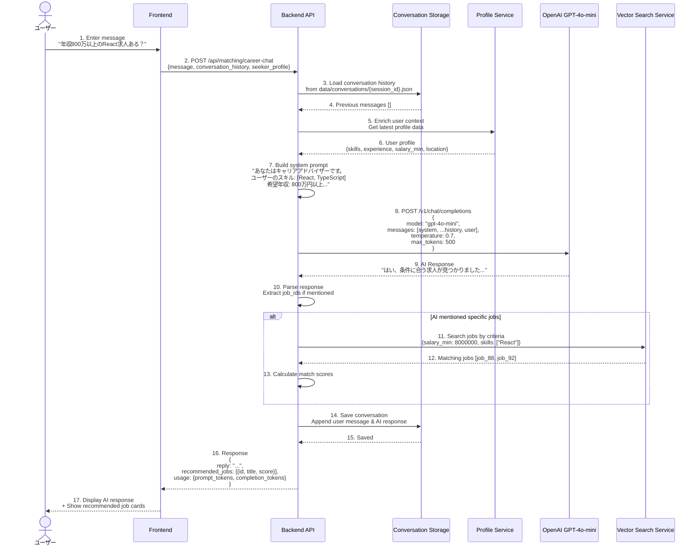

---

## 9. ER図（データベース）

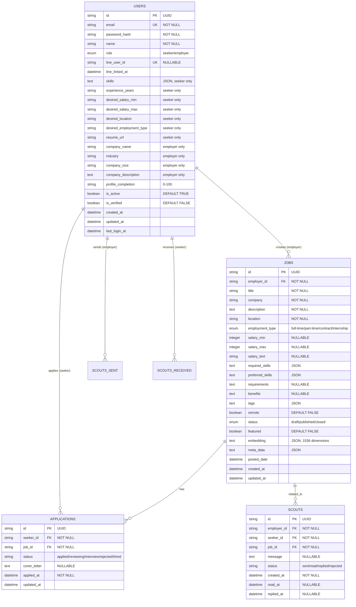

---

## 10. デプロイメントフロー図

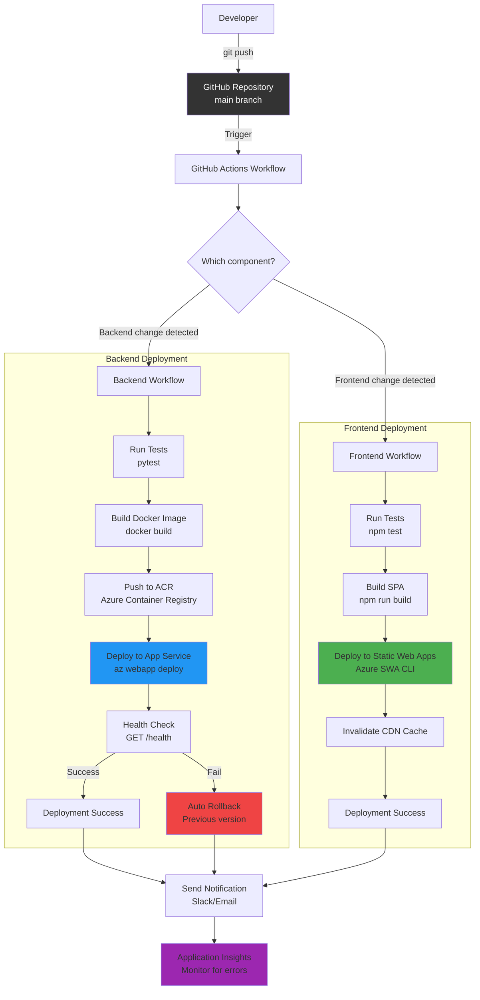

---

## 追加図: コンポーネント間の依存関係

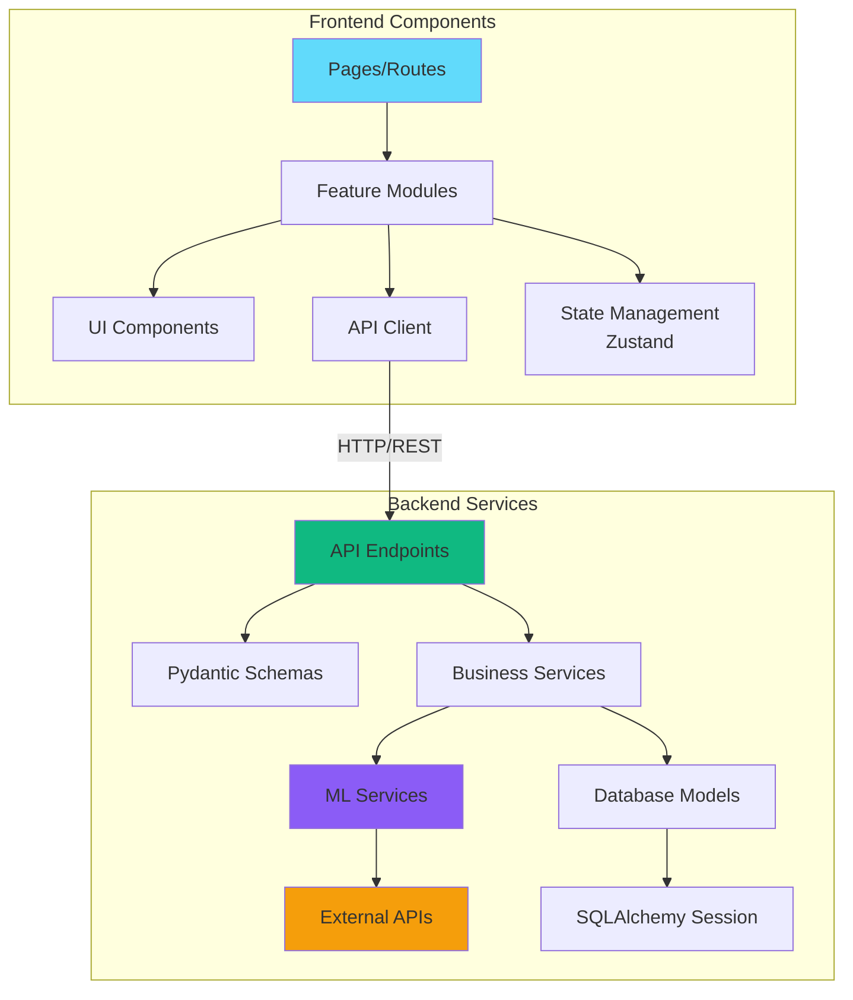

---

## 使用方法

このMarkdownファイルは以下で閲覧できます：

1. **GitHub/GitLab**: Mermaid図が自動レンダリングされます
2. **VSCode**: Mermaid Preview拡張機能をインストール
3. **オンラインビューア**: https://mermaid.live/ にコピー&ペースト
4. **HTMLエクスポート**: Markdownエディタ（Typora, MarkText等）でHTML/PDFにエクスポート

---

## 図の説明

| 図番号 | 図名 | 説明 |
|--------|------|------|
| 1 | システム全体構成図 | クライアント、Azure、外部サービスの全体像 |
| 2 | インフラ構成図 | Azure上の各サービスとCI/CD、監視の配置 |
| 3 | アプリケーションアーキテクチャ図 | フロントエンド・バックエンドの内部構造 |
| 4 | データフロー図 | 求職者・企業の主要フローのシーケンス |
| 5 | APIインターフェース図 | 各画面とAPIエンドポイントの対応関係 |
| 6 | 認証フロー図 | 登録、ログイン、トークン更新、LINE連携 |
| 7 | AIマッチング処理フロー図 | 埋め込み生成からスコア計算までの詳細 |
| 8 | 会話チャット処理フロー図 | ユーザーメッセージからAI応答までのフロー |
| 9 | ER図 | データベーステーブルのリレーション |
| 10 | デプロイメントフロー図 | GitHub ActionsによるCI/CDパイプライン |

---

**作成日**: 2025-12-25
**バージョン**: 1.0
**プロジェクト**: Job Matching Platform
