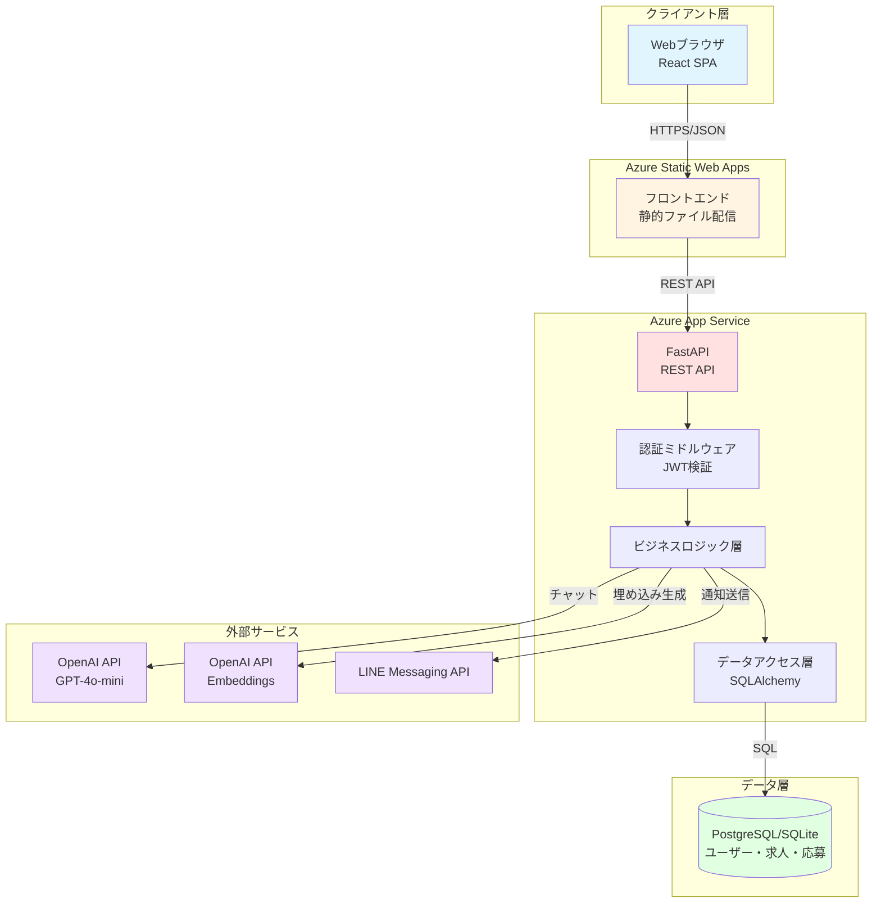

# AI求人マッチングシステム 基本設計書（ドラフト）

**バージョン**: 1.0
**作成日**: 2025年12月24日
**対象システム**: exitotrinity Job Matching Platform

---

## 目次

1. [システムの前提](#第1章-システムの前提)
2. [システムアーキテクチャ](#第2章-システムアーキテクチャ)
3. [AIマッチング設計仕様](#第3章-aiマッチング設計仕様)
4. [プロンプトエンジニアリング設計](#第4章-プロンプトエンジニアリング設計)
5. [セキュリティ・データ保護設計](#第5章-セキュリティデータ保護設計)
6. [API・インターフェース設計](#第6章-apiインターフェース設計)
7. [評価・テスト計画](#第7章-評価テスト計画)

---

## 第1章: システムの前提

### 1.1 目的

**求職者と企業の最適なマッチングを実現するAI搭載求人プラットフォーム**

- 求職者のスキル・経験と求人要件の自動マッチング
- 会話形式（チャット）での求人検索体験
- 企業の採用業務効率化（候補者推薦）

### 1.2 主要技術スタック

| レイヤー | 技術 | バージョン | 用途 |
|---------|------|-----------|------|
| **Frontend** | React | 18.3.1 | SPA構築 |
|  | TypeScript | 5.6.2 | 型安全性 |
|  | Vite | 6.0.1 | ビルドツール |
|  | Axios | - | HTTP通信 |
| **Backend** | FastAPI | 0.115.5 | RESTful API |
|  | Python | 3.10+ | 言語 |
|  | SQLAlchemy | 2.0.36 | ORM |
|  | Uvicorn | - | ASGIサーバー |
| **AI/ML** | OpenAI API | - | GPT-4o-mini |
|  | | - | text-embedding-3-small |
| **Database** | PostgreSQL | - | 本番DB（推奨） |
|  | SQLite | - | 開発DB |
| **Infrastructure** | Azure App Service | - | バックエンドホスティング |
|  | Azure Static Web Apps | - | フロントエンドホスティング |
|  | GitHub Actions | - | CI/CD |
|  | Docker | - | コンテナ化 |
| **External** | LINE Messaging API | - | 通知・連携 |

### 1.3 システムの特徴

**1. AIマッチングエンジン**
- OpenAI埋め込みモデルによるスキル・求人のセマンティック検索
- マッチングスコア（0-100%）の自動算出
- ベクトル類似度ベースの推薦システム

**2. 会話型インターフェース**
- 自然言語での求人検索（例：「年収500万円以上、リモート可能、Reactの求人」）
- コンテキストを保持した対話履歴管理
- リアルタイム応答（ストリーミング非対応、バッチ応答）

**3. セキュリティ重視**
- JWT（HS256）による認証
- パスワードのbcryptハッシュ化
- CORS制限、個人情報の厳格な管理

---

## 第2章: システムアーキテクチャ

### 2.1 全体構成



### 2.2 データフロー

#### 2.2.1 求人検索フロー（チャット機能）

```
[ユーザー入力]
    ↓
1. フロントエンド
    - メッセージ送信（POST /api/matching/career-chat）
    - ローディング表示
    ↓
2. バックエンド - 前処理
    - JWT検証（認証ミドルウェア）
    - ユーザープロフィール取得（DB）
    - 会話履歴のバリデーション（最大20メッセージ）
    ↓
3. AI処理
    - システムプロンプト構築
    - ユーザープロフィール注入（スキル、希望条件）
    - OpenAI API呼び出し（gpt-4o-mini）
    - タイムアウト: 30秒
    ↓
4. 後処理
    - レスポンス整形
    - ログ記録（会話内容はDBに保存しない - プライバシー考慮）
    ↓
5. フロントエンド
    - メッセージ表示
    - 検索結果カード表示（該当する場合）
```

#### 2.2.2 求人マッチングフロー（自動マッチング）

```
[求人登録/ユーザー登録]
    ↓
1. 埋め込みベクトル生成
    - 求人: タイトル + 説明 + 要件 → Embedding
    - ユーザー: スキル + 経験 → Embedding
    - モデル: text-embedding-3-small（1536次元）
    ↓
2. ベクトルストア保存
    - 現状: メモリ内（一時的）
    - 将来: Pinecone/Weaviate等に移行
    ↓
3. 類似度計算（コサイン類似度）
    - スコア範囲: 0.0 ～ 1.0
    - マッチ度変換: スコア × 100 → パーセンテージ（0-100%）
    ↓
4. 閾値フィルタリング
    - 表示閾値: 50%以上
    - 推奨閾値: 70%以上
    ↓
5. ランキング・表示
    - スコア降順でソート
    - 上位10件を返却
```

### 2.3 レイヤー構成（バックエンド）

```
app/
├── main.py                  # エントリーポイント、ルーター登録
├── core/
│   ├── config.py           # 環境変数管理（Pydantic Settings）
│   └── dependencies.py     # DI（認証、DB、サービス）
├── api/
│   └── endpoints/          # APIエンドポイント
│       ├── auth.py         # 認証API（登録/ログイン）
│       ├── jobs.py         # 求人API
│       ├── applications.py # 応募API
│       ├── users.py        # ユーザー設定API
│       └── matching.py     # マッチングAPI（チャット）
├── models/                 # SQLAlchemyモデル
│   └── user.py
├── schemas/                # Pydanticスキーマ（バリデーション）
│   ├── auth.py
│   └── user.py
├── services/               # ビジネスロジック
│   ├── openai_service.py   # OpenAI API呼び出し
│   ├── vector_search.py    # ベクトル検索
│   └── conversation_storage.py
├── ml/                     # AI/ML関連
│   ├── embedding_service.py   # 埋め込み生成
│   ├── matching_service.py    # マッチングロジック
│   └── conversation_service.py # チャット処理
└── db/
    └── session.py          # DB接続管理
```

---

## 第3章: AIマッチング設計仕様

### 3.1 埋め込みベクトル生成

#### 3.1.1 求人データの前処理

**対象フィールド**
```python
job_text = f"""
タイトル: {job.title}
説明: {job.description}
要件: {', '.join(job.requirements)}
場所: {job.location}
雇用形態: {job.employment_type}
タグ: {', '.join(job.tags)}
"""
```

**クリーニング処理**
1. HTMLタグの除去（BeautifulSoupを使用予定）
2. 連続する空白文字の正規化（`\s+` → ` `）
3. 最大文字数: 8000文字（GPT-4o-miniのトークン制限を考慮）
4. 文字数超過時: 先頭から8000文字でトリミング

**埋め込み生成**
```python
model = "text-embedding-3-small"
dimensions = 1536
response = openai.embeddings.create(
    model=model,
    input=cleaned_text,
    encoding_format="float"
)
embedding_vector = response.data[0].embedding  # List[float], len=1536
```

#### 3.1.2 ユーザープロフィールの前処理

**対象フィールド**
```python
user_text = f"""
スキル: {', '.join(user.skills)}
経験年数: {user.experience_years}
希望勤務地: {user.desired_location}
希望年収: {user.desired_salary_min}万円 〜 {user.desired_salary_max}万円
希望雇用形態: {user.desired_employment_type}
"""
```

**注意点**
- スキルが未設定（空配列）の場合は「未設定」として埋め込み
- NULLフィールドは「指定なし」に変換

### 3.2 ベクトル検索ロジック

#### 3.2.1 類似度計算（コサイン類似度）

```python
import numpy as np

def cosine_similarity(vec_a: List[float], vec_b: List[float]) -> float:
    """
    2つのベクトルのコサイン類似度を計算

    Args:
        vec_a: ベクトルA（1536次元）
        vec_b: ベクトルB（1536次元）

    Returns:
        類似度（0.0 〜 1.0）
    """
    a = np.array(vec_a)
    b = np.array(vec_b)

    dot_product = np.dot(a, b)
    norm_a = np.linalg.norm(a)
    norm_b = np.linalg.norm(b)

    if norm_a == 0 or norm_b == 0:
        return 0.0

    similarity = dot_product / (norm_a * norm_b)
    return max(0.0, min(1.0, similarity))  # 0-1の範囲にクリップ
```

#### 3.2.2 スコアリング・閾値設定

**マッチングスコアの変換**
```python
match_score = int(cosine_similarity * 100)  # 0-100のパーセンテージ
```

**フィルタリング閾値**
| レベル | 閾値 | 説明 |
|-------|-----|------|
| 最低表示 | 50% | この値未満は非表示 |
| 通常マッチ | 50-69% | マッチング候補 |
| 高マッチ | 70-84% | 推奨求人 |
| 最高マッチ | 85-100% | 強く推奨 |

**ランキングロジック**
1. 類似度でソート（降順）
2. 上位N件を取得（デフォルト: `top_k=10`）
3. スコア50%未満を除外
4. 同スコアの場合は求人の新しさ順（`created_at DESC`）

#### 3.2.3 ハイブリッド検索（将来拡張）

**現状**: ベクトル検索のみ

**今後の拡張案**:
```python
# ベクトル検索（セマンティック）
vector_results = vector_search(query_embedding, top_k=20)

# キーワード検索（BM25等）
keyword_results = keyword_search(query_text, top_k=20)

# スコアの重み付け結合
final_score = (
    0.7 * vector_score +  # ベクトル検索の重み
    0.3 * keyword_score   # キーワード検索の重み
)
```

### 3.3 チャンク分割戦略（将来のドキュメント検索用）

**注**: 現在は求人・ユーザー単位で埋め込みを生成しているため、チャンク分割は未実装。
将来、企業の長文ドキュメント（事業内容、福利厚生詳細など）を検索対象とする場合に適用。

**チャンク分割案**
- **チャンクサイズ**: 500文字
- **オーバーラップ**: 100文字（前後のコンテキスト保持）
- **分割単位**: 段落区切り（`\n\n`）を優先
- **メタデータ**: チャンク元のドキュメントID、ページ番号を付与

---

## 第4章: プロンプトエンジニアリング設計

### 4.1 システムプロンプト定義

#### 4.1.1 キャリア相談チャット（求職者向け）

**役割（ペルソナ）**
```
あなたは経験豊富なキャリアアドバイザーです。
求職者の希望条件をヒアリングし、最適な求人を提案する役割を担っています。
```

**制約事項**
```python
SYSTEM_PROMPT_SEEKER = """
あなたは親切で専門的なキャリアアドバイザーです。以下のルールに従ってください：

【役割】
- 求職者の希望条件（年収、勤務地、スキル、働き方）を丁寧にヒアリングする
- 具体的な求人情報は提供せず、条件の整理をサポートする
- ユーザーのスキルや経験を活かせる方向性をアドバイスする

【制約】
- 簡潔に回答してください（200文字以内）
- 敬語を使用してください
- 求人の具体的な企業名や詳細情報は言及しないでください（別途検索結果として表示されます）
- 個人情報（氏名、住所、電話番号）を尋ねないでください
- 転職を強く推奨する発言は避けてください

【トーン】
- 親しみやすく、励ましのトーン
- 専門用語を使う場合は簡単な説明を添える

【回答不可時の挙動】
ユーザーの質問が求人検索と無関係な場合：
「申し訳ございません。私は求人検索のお手伝いに特化したアシスタントです。転職やキャリアに関するご質問をお願いします。」
"""
```

#### 4.1.2 候補者検索チャット（企業向け）

```python
SYSTEM_PROMPT_EMPLOYER = """
あなたは採用支援の専門家です。企業の採用ニーズをヒアリングし、最適な候補者要件を整理します。

【役割】
- 求めるポジション、スキル、経験年数を明確化する
- 採用要件の優先順位付けをサポートする

【制約】
- 簡潔に回答してください（200文字以内）
- 候補者の個人情報には言及しないでください
- 差別的な表現（年齢、性別、国籍等）を含む要件は指摘し、修正を促してください

【回答不可時の挙動】
採用と無関係な質問の場合：
「申し訳ございません。私は採用支援に特化したアシスタントです。求人や候補者に関するご質問をお願いします。」
"""
```

### 4.2 コンテキスト注入

#### 4.2.1 ユーザープロフィールの注入

**注入位置**: システムプロンプトの後、ユーザーメッセージの前

```python
context = f"""
【ユーザープロフィール】
- スキル: {', '.join(user.skills) if user.skills else '未登録'}
- 経験年数: {user.experience_years or '未登録'}
- 希望勤務地: {user.desired_location or '指定なし'}
- 希望年収: {user.desired_salary_min}万円 〜 {user.desired_salary_max}万円
- 希望雇用形態: {user.desired_employment_type or '指定なし'}

上記のプロフィールを考慮しながら、ユーザーの質問に回答してください。
"""
```

#### 4.2.2 会話履歴の管理

**最大保持数**: 20メッセージ（10往復）
- 超過時: 古い履歴から削除（FIFO）
- 理由: トークン制限（GPT-4o-miniは128Kトークンだが、コスト削減のため制限）

**履歴形式**
```python
conversation_history = [
    {"role": "user", "content": "こんにちは"},
    {"role": "assistant", "content": "こんにちは。どのような仕事をお探しですか？"},
    {"role": "user", "content": "年収500万円以上のReactエンジニアの求人"},
    # ...
]
```

**プロンプト構築**
```python
messages = [
    {"role": "system", "content": SYSTEM_PROMPT_SEEKER},
    {"role": "system", "content": context},  # プロフィール注入
    *conversation_history,  # 会話履歴展開
    {"role": "user", "content": user_input}
]
```

### 4.3 Few-Shot 学習（将来拡張）

**現状**: Few-Shotは未実装（システムプロンプトのみ）

**今後の追加案**:
```python
FEW_SHOT_EXAMPLES = [
    {
        "user": "年収600万円以上、東京都、リモート可能な求人を探しています",
        "assistant": """
承知しました。以下の条件で求人を検索しますね：
- 年収: 600万円以上
- 勤務地: 東京都
- 働き方: リモート可能

他にご希望のスキルや雇用形態はございますか？例えば「React」や「正社員」などがあればお聞かせください。
"""
    },
    {
        "user": "未経験でもエンジニアになれますか？",
        "assistant": """
未経験からエンジニアを目指すことは可能です！
まずは、以下をお聞かせください：
- 学習中のプログラミング言語やフレームワークはありますか？
- 希望する分野（Web開発、アプリ開発など）はありますか？

未経験者歓迎の求人もご紹介できますので、一緒に探していきましょう。
"""
    }
]
```

**注入方法**: システムプロンプトの後に例を追加
```python
messages = [
    {"role": "system", "content": SYSTEM_PROMPT},
    *FEW_SHOT_EXAMPLES,  # Few-Shot例
    *conversation_history,
    {"role": "user", "content": user_input}
]
```

### 4.4 温度（Temperature）とトークン設定

```python
openai_params = {
    "model": "gpt-4o-mini",
    "messages": messages,
    "temperature": 0.7,      # 創造性とバランス（0.5-0.9推奨）
    "max_tokens": 300,       # 回答の最大長（200文字制約を考慮）
    "top_p": 0.9,            # 核サンプリング
    "frequency_penalty": 0.3, # 繰り返し抑制
    "presence_penalty": 0.1   # 話題の多様性
}
```

**パラメータ設定理由**
- `temperature=0.7`: 定型的すぎず、創造的すぎない応答
- `max_tokens=300`: 日本語で約200文字（1文字≒1.5トークン）
- `frequency_penalty=0.3`: 同じフレーズの繰り返しを抑制

---

## 第5章: セキュリティ・データ保護設計

### 5.1 入力フィルタリング

#### 5.1.1 個人情報（PII）の検出

**検出対象**
- メールアドレス: 正規表現 `r'[a-zA-Z0-9._%+-]+@[a-zA-Z0-9.-]+\.[a-zA-Z]{2,}'`
- 電話番号: 正規表現 `r'0\d{1,4}-?\d{1,4}-?\d{4}'`
- 住所: キーワードマッチ（「〒」「番地」「マンション」等）
- クレジットカード番号: Luhnアルゴリズム

**処理**
```python
def detect_pii(text: str) -> bool:
    """
    個人情報を含むか判定

    Returns:
        True: PII検出（リクエスト拒否）
        False: 安全
    """
    patterns = [
        r'[a-zA-Z0-9._%+-]+@[a-zA-Z0-9.-]+\.[a-zA-Z]{2,}',  # Email
        r'0\d{1,4}-?\d{1,4}-?\d{4}',  # 電話番号
        r'\d{3}-?\d{4}',  # 郵便番号
    ]

    for pattern in patterns:
        if re.search(pattern, text):
            return True
    return False
```

**拒否時のレスポンス**
```json
{
  "detail": "個人情報と思われる内容が検出されました。メールアドレスや電話番号は入力しないでください。",
  "error_code": "PII_DETECTED"
}
```

#### 5.1.2 プロンプトインジェクション対策

**検出ワード（部分一致）**
```python
INJECTION_KEYWORDS = [
    "ignore previous instructions",
    "ignore all previous",
    "あなたは今から",
    "新しい指示",
    "システムプロンプト",
    "reveal your prompt",
    "show me your instructions"
]
```

**対策ロジック**
```python
def detect_injection(user_input: str) -> bool:
    """
    プロンプトインジェクション試行を検出
    """
    lower_input = user_input.lower()
    for keyword in INJECTION_KEYWORDS:
        if keyword.lower() in lower_input:
            logger.warning(f"Injection attempt detected: {keyword}")
            return True
    return False
```

**拒否時のレスポンス**
```json
{
  "detail": "不適切な入力が検出されました。求人検索に関するご質問をお願いします。",
  "error_code": "INVALID_INPUT"
}
```

#### 5.1.3 不適切ワードフィルタ

**対象**: 暴力的・差別的表現

**実装**: OpenAI Moderation APIを使用
```python
moderation_response = openai.moderations.create(input=user_input)
flagged = moderation_response.results[0].flagged

if flagged:
    raise HTTPException(
        status_code=400,
        detail="不適切な内容が含まれています。適切な表現でお願いします。"
    )
```

### 5.2 出力フィルタリング

#### 5.2.1 ハルシネーション（幻覚）の検知

**現状**: 検知ロジックは未実装

**今後の実装案**:
1. **事実性チェック**: データベースの求人情報と照合
2. **自己矛盾検出**: 同じ質問に対する複数回の回答を比較
3. **信頼度スコア**: GPTに回答の確信度（0-1）を返させる

**例: 信頼度スコア取得**
```python
# プロンプトに追加
additional_instruction = """
回答の最後に、以下の形式で確信度を付与してください：
[確信度: 0.0-1.0]
"""
```

#### 5.2.2 フォーマット検証

**JSON形式で返却が必要な場合**（将来拡張）
```python
import json

def validate_json_response(response_text: str) -> dict:
    """
    LLMレスポンスがJSONとして妥当か検証
    """
    try:
        data = json.loads(response_text)
        return data
    except json.JSONDecodeError:
        logger.error("Invalid JSON response from LLM")
        # フォールバック: テキストのまま返却
        return {"text": response_text}
```

### 5.3 認証・認可

#### 5.3.1 JWT認証

**トークン生成**
```python
from jose import jwt
from datetime import datetime, timedelta

def create_access_token(user_id: str) -> tuple[str, int]:
    """
    JWTトークンを生成

    Returns:
        (token, expires_in_seconds)
    """
    expires_delta = timedelta(minutes=30)
    expire = datetime.utcnow() + expires_delta

    payload = {
        "sub": user_id,
        "exp": expire
    }

    token = jwt.encode(
        payload,
        settings.secret_key,
        algorithm="HS256"
    )

    return token, 30 * 60  # 1800秒
```

**トークン検証**
```python
from jose import jwt, JWTError

def get_current_user(token: str, db: Session) -> User:
    """
    JWTから現在のユーザーを取得

    Raises:
        HTTPException: トークンが無効、期限切れ、ユーザーが存在しない
    """
    try:
        payload = jwt.decode(
            token,
            settings.secret_key,
            algorithms=["HS256"]
        )
        user_id: str = payload.get("sub")

        if user_id is None:
            raise HTTPException(status_code=401, detail="無効なトークン")

    except JWTError:
        raise HTTPException(status_code=401, detail="トークンの検証に失敗しました")

    user = db.query(User).filter(User.id == user_id).first()

    if user is None or not user.is_active:
        raise HTTPException(status_code=401, detail="ユーザーが見つかりません")

    return user
```

#### 5.3.2 パスワード管理

**ハッシュ化**
```python
import bcrypt

def hash_password(plain_password: str) -> str:
    """
    bcryptでパスワードをハッシュ化
    """
    salt = bcrypt.gensalt()
    hashed = bcrypt.hashpw(plain_password.encode('utf-8'), salt)
    return hashed.decode('utf-8')

def verify_password(plain_password: str, hashed_password: str) -> bool:
    """
    パスワードを検証
    """
    return bcrypt.checkpw(
        plain_password.encode('utf-8'),
        hashed_password.encode('utf-8')
    )
```

**パスワードポリシー（フロントエンド）**
- 最小長: 8文字
- 推奨: 大文字、小文字、数字、記号を含む

### 5.4 データ保護

#### 5.4.1 会話ログの保存ポリシー

**方針**: 会話内容はデータベースに**保存しない**
- 理由: プライバシー保護、GDPR対応
- ログ: エラー発生時のみサーバーログに記録（個人情報はマスキング）

**例外**: ユーザーが明示的に「保存」を選択した場合のみ保存（機能未実装）

#### 5.4.2 データベース暗号化

**保存時暗号化**: Azureの機能を使用
- Azure Database for PostgreSQLの「Transparent Data Encryption (TDE)」

**通信暗号化**: TLS 1.2以上

---

## 第6章: API・インターフェース設計

### 6.1 エンドポイント定義

#### 6.1.1 キャリア相談チャットAPI

**エンドポイント**: `POST /api/matching/career-chat`

**認証**: 必要（JWT Bearer Token）

**リクエスト**

```json
{
  "message": "年収500万円以上、リモート可能、Reactの求人を探しています",
  "conversation_history": [
    {
      "role": "user",
      "content": "こんにちは"
    },
    {
      "role": "assistant",
      "content": "こんにちは。どのような仕事をお探しですか？"
    }
  ],
  "seeker_profile": {
    "skills": ["React", "TypeScript"],
    "experience": "3-5年",
    "location": "東京都",
    "desired_salary_min": 5000000,
    "preferred_employment_types": ["正社員"]
  }
}
```

**リクエストスキーマ（Pydantic）**
```python
from pydantic import BaseModel, Field
from typing import List, Optional

class CareerChatMessage(BaseModel):
    role: str = Field(..., regex="^(user|assistant)$")
    content: str = Field(..., min_length=1, max_length=2000)

class SeekerProfileRequest(BaseModel):
    skills: List[str] = Field(default_factory=list)
    experience: Optional[str] = None
    education: Optional[str] = None
    location: Optional[str] = None
    desired_salary_min: Optional[int] = None
    preferred_employment_types: List[str] = Field(default_factory=list)

class CareerChatRequest(BaseModel):
    message: str = Field(..., min_length=1, max_length=500)
    conversation_history: List[CareerChatMessage] = Field(
        default_factory=list,
        max_items=20  # 最大20メッセージ
    )
    seeker_profile: SeekerProfileRequest
```

**レスポンス（200 OK）**
```json
{
  "reply": "承知しました。年収500万円以上、リモート可能、Reactを使用する求人をお探しですね。\n\nあなたのスキルとマッチする求人をいくつか見つけました。画面に表示されている求人をご確認ください。"
}
```

**レスポンススキーマ**
```python
class CareerChatResponse(BaseModel):
    reply: str = Field(..., max_length=1000)
```

**エラーレスポンス**

| ステータス | 条件 | レスポンス |
|-----------|------|-----------|
| 400 | バリデーションエラー | `{"detail": "messageは500文字以内で入力してください"}` |
| 400 | PII検出 | `{"detail": "個人情報と思われる内容が検出されました", "error_code": "PII_DETECTED"}` |
| 400 | 不適切ワード | `{"detail": "不適切な内容が含まれています", "error_code": "MODERATION_FLAGGED"}` |
| 401 | 認証エラー | `{"detail": "認証情報が無効です"}` |
| 429 | レート制限 | `{"detail": "リクエストが多すぎます。しばらくお待ちください"}` |
| 500 | OpenAI APIエラー | `{"detail": "AIサービスでエラーが発生しました"}` |
| 504 | タイムアウト | `{"detail": "応答がタイムアウトしました。もう一度お試しください"}` |

### 6.2 ストリーミング対応（将来拡張）

**現状**: 非対応（バッチ応答のみ）

**今後の実装案**: Server-Sent Events (SSE)

**エンドポイント**: `POST /api/matching/career-chat/stream`

**実装例**
```python
from fastapi.responses import StreamingResponse
import asyncio

@router.post("/career-chat/stream")
async def career_chat_stream(request: CareerChatRequest):
    async def generate():
        # OpenAI Streaming
        stream = openai.chat.completions.create(
            model="gpt-4o-mini",
            messages=messages,
            stream=True
        )

        for chunk in stream:
            if chunk.choices[0].delta.content:
                content = chunk.choices[0].delta.content
                yield f"data: {json.dumps({'content': content})}\n\n"
                await asyncio.sleep(0.01)  # 負荷軽減

        yield "data: [DONE]\n\n"

    return StreamingResponse(
        generate(),
        media_type="text/event-stream"
    )
```

**フロントエンド（受信側）**
```typescript
const eventSource = new EventSource('/api/matching/career-chat/stream');

eventSource.onmessage = (event) => {
  if (event.data === '[DONE]') {
    eventSource.close();
    return;
  }

  const { content } = JSON.parse(event.data);
  // メッセージを逐次表示
  appendMessage(content);
};
```

### 6.3 エラーハンドリング詳細

#### 6.3.1 OpenAI APIのタイムアウト

**設定**
```python
import httpx

async def call_openai_with_timeout(messages: List[dict]) -> str:
    """
    タイムアウト付きでOpenAI APIを呼び出し
    """
    try:
        async with httpx.AsyncClient(timeout=30.0) as client:
            response = await openai.chat.completions.create(
                model="gpt-4o-mini",
                messages=messages,
                timeout=30
            )
            return response.choices[0].message.content

    except httpx.TimeoutException:
        logger.error("OpenAI API timeout")
        raise HTTPException(
            status_code=504,
            detail="応答がタイムアウトしました。もう一度お試しください"
        )
```

#### 6.3.2 トークン上限超過

**検出**
```python
from tiktoken import encoding_for_model

def count_tokens(messages: List[dict], model: str = "gpt-4o-mini") -> int:
    """
    メッセージのトークン数をカウント
    """
    encoding = encoding_for_model(model)

    num_tokens = 0
    for message in messages:
        num_tokens += 4  # メッセージのオーバーヘッド
        for key, value in message.items():
            num_tokens += len(encoding.encode(value))

    num_tokens += 2  # 応答のプロンプト
    return num_tokens
```

**対策**
```python
MAX_TOKENS = 10000  # GPT-4o-miniの入力制限を考慮

if count_tokens(messages) > MAX_TOKENS:
    # 古い会話履歴を削除
    while count_tokens(messages) > MAX_TOKENS and len(conversation_history) > 0:
        conversation_history.pop(0)
```

#### 6.3.3 検索ヒットなし（No Hits）

**フォールバック挙動**

```python
# ベクトル検索実行
search_results = vector_search(query_embedding, top_k=10, threshold=0.5)

if len(search_results) == 0:
    # 検索結果なし → LLMに明示的に伝える
    no_results_message = """
    【検索結果】
    該当する求人が見つかりませんでした。

    以下をユーザーに伝えてください：
    - 条件を緩和すると、より多くの求人が見つかる可能性があります
    - 具体的なスキルや勤務地を教えていただくと、より正確な検索ができます
    """

    messages.append({"role": "system", "content": no_results_message})
```

**LLMの回答例**
```
申し訳ございません。現在、ご希望の条件に完全に一致する求人は見つかりませんでした。

以下の方法をお試しいただけますか？
- 勤務地の範囲を広げる（例: 東京都 → 関東圏）
- 年収の下限を下げる
- 「リモート可」の条件を外す

他にご希望の条件がございましたら、お聞かせください。
```

---

## 第7章: 評価・テスト計画

### 7.1 評価指標（KPI）

#### 7.1.1 AIマッチングの精度

| 指標 | 定義 | 目標値 | 測定方法 |
|-----|------|--------|---------|
| **適合率（Precision）** | 推薦した求人のうち、実際に応募された割合 | 30%以上 | `応募数 / 推薦求人表示数` |
| **再現率（Recall）** | 全応募のうち、システムが推薦した求人の割合 | 70%以上 | `システム推薦からの応募 / 全応募数` |
| **マッチングスコア精度** | ユーザー評価とシステムスコアの相関 | 0.6以上 | ピアソン相関係数 |

**測定データ収集**
- 求人表示ログ（どの求人が表示されたか）
- 応募ログ（どの求人に応募したか）
- ユーザーフィードバック（「この求人は参考になりましたか？」5段階評価）

#### 7.1.2 チャット機能の品質

| 指標 | 定義 | 目標値 | 測定方法 |
|-----|------|--------|---------|
| **Helpfulness（有用性）** | ユーザーの質問に有益な回答をしたか | 4.0/5.0 | ユーザー評価（5段階） |
| **Truthfulness（真実性）** | 回答が事実に基づいているか | 95%以上 | 人間評価者によるスポットチェック |
| **Safety（安全性）** | 不適切な内容を含まないか | 99%以上 | Moderation API + 人間レビュー |
| **Latency（応答速度）** | 回答生成にかかる時間 | 3秒以内（90パーセンタイル） | サーバーログ分析 |

#### 7.1.3 ビジネス指標

| 指標 | 定義 | 目標値 |
|-----|------|--------|
| **MAU（月間アクティブユーザー）** | 月に1回以上ログインしたユーザー数 | 1,000人 |
| **応募完了率** | 求人表示から応募完了までの割合 | 10%以上 |
| **登録完了率** | 新規登録開始から完了までの割合 | 60%以上 |

### 7.2 テスト手法

#### 7.2.1 ユニットテスト

**対象**: ビジネスロジック、ユーティリティ関数

**フレームワーク**: pytest

**例: ベクトル検索のテスト**
```python
# tests/test_vector_search.py
import pytest
from app.ml.matching_service import MatchingService

def test_cosine_similarity():
    """コサイン類似度の計算が正しいか"""
    vec_a = [1.0, 0.0, 0.0]
    vec_b = [1.0, 0.0, 0.0]

    similarity = cosine_similarity(vec_a, vec_b)
    assert similarity == 1.0  # 完全一致

def test_cosine_similarity_orthogonal():
    """直交ベクトルの類似度は0"""
    vec_a = [1.0, 0.0]
    vec_b = [0.0, 1.0]

    similarity = cosine_similarity(vec_a, vec_b)
    assert similarity == 0.0

def test_match_score_conversion():
    """類似度からマッチスコアへの変換"""
    similarity = 0.85
    match_score = int(similarity * 100)

    assert match_score == 85
```

#### 7.2.2 統合テスト

**対象**: API エンドポイント

**フレームワーク**: pytest + TestClient (FastAPI)

**例: チャットAPIのテスト**
```python
# tests/test_matching_api.py
from fastapi.testclient import TestClient
from app.main import app

client = TestClient(app)

def test_career_chat_success():
    """正常なチャットリクエスト"""
    response = client.post(
        "/api/matching/career-chat",
        json={
            "message": "Reactの求人を探しています",
            "conversation_history": [],
            "seeker_profile": {
                "skills": ["React"],
                "preferred_employment_types": ["正社員"]
            }
        },
        headers={"Authorization": f"Bearer {test_token}"}
    )

    assert response.status_code == 200
    data = response.json()
    assert "reply" in data
    assert len(data["reply"]) > 0

def test_career_chat_pii_detection():
    """個人情報を含む入力を拒否"""
    response = client.post(
        "/api/matching/career-chat",
        json={
            "message": "私のメールアドレスはtest@example.comです",
            "conversation_history": [],
            "seeker_profile": {}
        },
        headers={"Authorization": f"Bearer {test_token}"}
    )

    assert response.status_code == 400
    assert "PII_DETECTED" in response.json()["error_code"]
```

#### 7.2.3 LLM-as-a-Judge（自動評価）

**目的**: チャット回答の品質を自動評価

**手法**: 別のLLM（GPT-4o）を評価者として使用

**評価プロンプト**
```python
JUDGE_PROMPT = """
以下のチャットボットの回答を評価してください。

【ユーザー質問】
{user_question}

【チャットボット回答】
{bot_response}

【評価基準】
1. 有用性（1-5点）: ユーザーの質問に適切に答えているか
2. 正確性（1-5点）: 事実に基づいた回答か（推測や誇張がないか）
3. 簡潔性（1-5点）: 冗長でなく、要点を押さえているか
4. トーン（1-5点）: 親しみやすく、適切な敬語を使用しているか

以下のJSON形式で回答してください：
{
  "helpfulness": 4,
  "accuracy": 5,
  "conciseness": 3,
  "tone": 5,
  "reasoning": "評価理由を簡潔に記述"
}
"""
```

**実装例**
```python
def evaluate_response_with_llm(user_question: str, bot_response: str) -> dict:
    """
    LLMを使って回答を評価
    """
    prompt = JUDGE_PROMPT.format(
        user_question=user_question,
        bot_response=bot_response
    )

    response = openai.chat.completions.create(
        model="gpt-4o",  # より高性能なモデルで評価
        messages=[{"role": "user", "content": prompt}],
        response_format={"type": "json_object"}
    )

    evaluation = json.loads(response.choices[0].message.content)
    return evaluation
```

#### 7.2.4 ゴールデンデータセット

**目的**: 回帰テスト（システム更新後の品質劣化検知）

**データセット構成**
```python
GOLDEN_DATASET = [
    {
        "id": "test_001",
        "user_question": "年収600万円以上、東京都、リモート可能なReactエンジニアの求人",
        "expected_keywords": ["React", "リモート", "東京"],
        "expected_tone": "polite",
        "min_helpfulness_score": 4.0
    },
    {
        "id": "test_002",
        "user_question": "未経験でもエンジニアになれますか？",
        "expected_keywords": ["未経験", "学習", "可能"],
        "expected_tone": "encouraging",
        "min_helpfulness_score": 4.0
    },
    # ... 合計50-100件
]
```

**実行**
```python
def run_golden_dataset_test():
    """
    ゴールデンデータセットを使った自動評価
    """
    results = []

    for test_case in GOLDEN_DATASET:
        response = call_chat_api(test_case["user_question"])
        evaluation = evaluate_response_with_llm(
            test_case["user_question"],
            response["reply"]
        )

        # キーワードチェック
        contains_keywords = all(
            kw in response["reply"]
            for kw in test_case["expected_keywords"]
        )

        # スコアチェック
        passes = (
            evaluation["helpfulness"] >= test_case["min_helpfulness_score"]
            and contains_keywords
        )

        results.append({
            "test_id": test_case["id"],
            "passed": passes,
            "evaluation": evaluation
        })

    # 合格率を計算
    pass_rate = sum(r["passed"] for r in results) / len(results)
    print(f"Pass Rate: {pass_rate * 100:.1f}%")

    return results
```

### 7.3 A/Bテスト計画（将来）

**テスト対象**
1. プロンプトのバリエーション（温度、Few-Shot有無）
2. マッチングスコアの閾値（50% vs 60%）
3. チャットUIの配置（左右分割 vs 上下分割）

**評価指標**
- 応募率（Conversion Rate）
- チャット満足度（5段階評価）
- セッション時間

**ツール**: Firebase Remote Config または 自前の機能フラグ管理

---

## 付録A: 設定値一覧

### A.1 環境変数

| 変数名 | 説明 | デフォルト値 | 本番推奨値 |
|-------|------|------------|----------|
| `OPENAI_API_KEY` | OpenAI APIキー | - | （秘密鍵） |
| `OPENAI_CHAT_MODEL` | チャット用モデル | gpt-4o-mini | gpt-4o-mini |
| `OPENAI_EMBEDDING_MODEL` | 埋め込み用モデル | text-embedding-3-small | text-embedding-3-small |
| `OPENAI_EMBEDDING_DIMENSION` | 埋め込み次元数 | 1536 | 1536 |
| `SECRET_KEY` | JWT署名鍵 | - | （強力なランダム文字列） |
| `DATABASE_URL` | DB接続URL | sqlite:///./job_matching.db | postgresql://... |
| `CORS_ORIGINS` | 許可オリジン | localhost:5173 | https://gray-sky-... |
| `ACCESS_TOKEN_EXPIRE_MINUTES` | トークン有効期限 | 30 | 30 |

### A.2 定数・閾値

| パラメータ | 値 | 説明 |
|----------|-----|------|
| **AIマッチング** | | |
| 最低表示スコア | 50% | この値未満は非表示 |
| 推奨スコア | 70% | 「おすすめ」として強調表示 |
| Top-K | 10 | 上位何件を返すか |
| **チャット** | | |
| 最大会話履歴 | 20メッセージ | これを超えると古いものから削除 |
| 最大入力文字数 | 500文字 | ユーザー入力の上限 |
| 最大出力トークン | 300トークン | LLM回答の上限 |
| タイムアウト | 30秒 | OpenAI APIのタイムアウト |
| Temperature | 0.7 | LLMの創造性パラメータ |
| **セキュリティ** | | |
| パスワード最小長 | 8文字 | フロントエンドバリデーション |
| JWT有効期限 | 30分 | トークンの有効期限 |

---

## 付録B: 用語集

| 用語 | 説明 |
|-----|------|
| **RAG** | Retrieval-Augmented Generation（検索拡張生成）。外部データを検索してLLMに与える手法 |
| **Embedding（埋め込み）** | テキストを数値ベクトルに変換したもの。類似度計算に使用 |
| **Cosine Similarity** | 2つのベクトルの類似度を測る指標（-1〜1、通常は0〜1） |
| **Token** | LLMが処理するテキストの最小単位。日本語は1文字≒1.5トークン |
| **Temperature** | LLMの創造性パラメータ。高いほど多様な回答、低いほど安定した回答 |
| **Few-Shot** | 少数の入力例を与えて学習させる手法 |
| **PII** | Personally Identifiable Information（個人を特定できる情報） |
| **Hallucination（幻覚）** | LLMが事実でない情報を生成する現象 |
| **JWT** | JSON Web Token。トークンベース認証方式 |

---

## 付録C: 参考資料

1. **OpenAI API Documentation**
   - https://platform.openai.com/docs

2. **FastAPI Documentation**
   - https://fastapi.tiangolo.com/

3. **Azure Documentation**
   - https://docs.microsoft.com/azure/

4. **プロンプトエンジニアリングガイド**
   - https://platform.openai.com/docs/guides/prompt-engineering

5. **RAG実装のベストプラクティス**
   - https://arxiv.org/abs/2005.11401

---

## 付録D: 変更履歴

| バージョン | 日付 | 変更内容 | 作成者 |
|-----------|------|---------|--------|
| 1.0 | 2025-12-24 | 初版作成 | Claude Code |

---

**文書終了**
